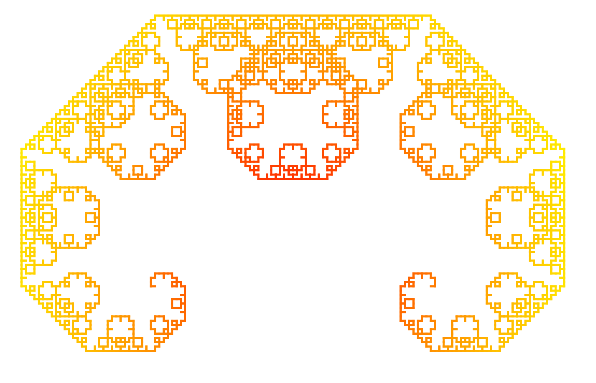

# Levy C curve in GCLC
Lévy C curve is a self-similar fractal curve. The construction starts with a straight line.
An isosceles triangle with a 90 degree angle is built using this line as its hypotenuse, and
the original line is then replaced by the other two sides of this triangle. In the every
following iteration we replace given lines with the sides of the apropriate isosceles triangle.
The code in this repository shows an implementation of the construction of this fractal using
GCLC, a mathematical tool for visualising geometry. You can find out more about it on 
this link: https://poincare.matf.bg.ac.rs/~janicic/gclc/ . 

